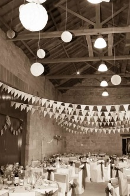
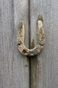
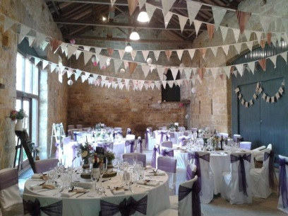
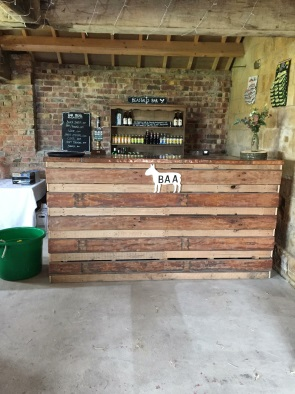
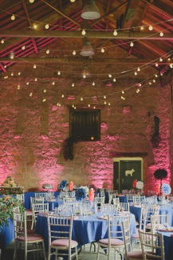
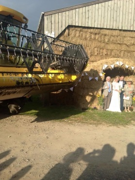

**Big Barn Bash**

Castle Farm is the perfect setting for your wedding, event or special
occasion.

As well as being a working farm with beautiful rolling countryside and a
peaceful, tranquil setting as your backdrop. Castle Farm offers you an
ideal location to guarantee a perfect day (not including the weather!)
that will be individual, that little bit different, and be remembered
for years to come.

**Where it all began…….**

Castle Farm hosted two Brown daughter Weddings
in the space of 6 months. The first held in the depths of winter in a
PapaKata marquee. The second a mid-summer wedding held in the stone
barn. The family had such an enjoyable time and were delighted with the
response from the guests that attended. It made sense to put Rebecca’s
background of co-ordinating events to good use, and welcome others to
the farm.

**The Facilities**

The space comprises of the beautiful stone barn, perfect for a sit down
banquet or buffet. The space also allows for evening entertainment and
suitable room to party.

The brick Roundhouse is the ideal space for reception drinks and is the
best place to home a bar. Later on the Roundhouse can also be used as a
break out or quiet area.

Luxury toilet facilities (with disabled access) are located onsite with
an original farmhouse stone sink. Meaning no further loo hiring is
required.

A small kitchenette area for caterers, with the provision of additional
space for catering requirements is also provided.

The farm also has plenty of parking and outdoor space with a seasonal
changing backdrop ideal for photographs.

Castle Farm provides a space that is a rustic blank canvas. It offers a
venue that will be unique with perfect scope for a personalised and
tailored venue to suit all tastes.

Castle Farm understands that everyone is individual and event
requirements are very personal, and will work with you to create the
perfect day.

Please visit the contact page to request further information and to
arrange a visit.
